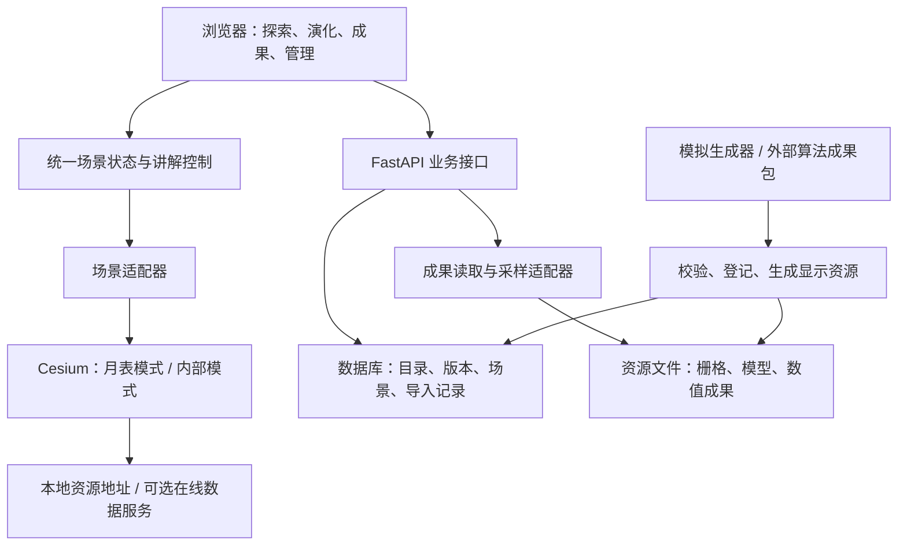

# 月球 Web 科普与模型展示系统详细实施方案

版本：v1.0｜日期：2026-09-14｜状态：开发基线草案，可据此分阶段实施。

本方案由合同、现有 HTML、用户确认和公开项目调研共同形成。它规定后续工作，不表示所列功能已经开发完成。配套阅读：[开源调研与复用评估](开源调研与复用评估.md)。

## 1. 项目定位与已确认边界

### 1.1 已确认事项

- 现有代码仅为 `月球可视化/index.html` 及其模型、贴图、启动文件。
- 用户需要 Web 端，主要服务未来的科普演示，同时覆盖合同中软件平台承担的内容。
- UE5 是效果提升的可选技术，不是必须采用的技术。
- 实体球体、灯具等制作不在本次软件开发范围。
- 科研算法由其他人提供；目前没有输出样例，允许先构造模拟成果。
- 第一版可以在线使用，后续再考虑断网运行。离线不是第一版完成条件。
- 本轮交付调研与实施方案；业务代码开发在后续阶段开展。

### 1.2 暂定事项

| 项目 | 本方案采用的默认值 | 何时再确认 |
|---|---|---|
| 开发环境 | 当前 Windows 工作区，桌面 Chrome/Edge | S0 记录实际版本和硬件 |
| 演示环境 | 桌面浏览器、大屏优先；窗口布局兼容 1366×768 和 1920×1080 | S1 效果评审时 |
| 访问模式 | 在线 Web；每个浏览器独立操作 | S0 确认部署地址与对外范围 |
| 内容语言 | 简体中文，专业名词可附英文 | S3 第一版讲解稿 |
| 首版内容 | 现今月球 + 3 个早期阶段配置，其中至少 2 个早期场景完成展示 | S4 科学内容核对 |
| 讲解方式 | 短文、字幕、镜头与高亮；首版不要求语音合成 | S3 演示评审 |
| 账号 | 浏览展示可开放，管理操作需要管理员身份 | S2 接入管理端之前 |
| 目标日期、人数 | 尚未明确，不据此承诺具体交付日期 | 排日历计划和部署之前 |

合同写有 2026 年 9 月验收、10 月 4 日全部交付。当前方案不能把允许模拟开发理解为合同允许用模拟成果最终验收。若实际仍按上述时间执行，应先确定可演示版本范围、真实数据交付日和验收安排。

### 1.3 交付分为两种状态

**V0.1 可演示原型**：主要科普流程可操作；模拟模型与数据有明确标识；适合讨论产品效果和接口。

**V1.0 软件交付版**：除软件功能与部署通过验证外，合同涉及的数据、模型、场景和科学说明已完成真实接入或明确标记尚待提供。缺少真实成果时可以交付阶段软件，但不能称合同已全部满足。

## 2. 合同要求与软件任务对应

合同来源：[向下解析延拓.pdf](../向下解析延拓.pdf)。下表使用 PDF 文件顺序页码，主要依据第 3—5 页；不把原 UE5 MD 中的技术选型当成合同原文。

| 编号 | 合同内容及位置 | 软件落实 | 外部输入/边界 | 验证证据 |
|---|---|---|---|---|
| R01 | 统一月球数据库和三维展示平台，第 3 页 | 数据目录、模型库、资源关联和版本管理 | 真实数据来源需补齐 | 导入记录、数据库记录、展示截图 |
| R02 | 同一空间参考系和时间轴下联动 DEM、反照率、地质基图等，第 3 页 | 月球坐标规范、图层管理、年代关联 | 影像不自动等同于反照率；缺少地质图时不虚构 | 配准验证、图层元数据、场景切换记录 |
| R03 | 一维分层、核幔旋转椭球、内核球面和热演化模型整合，第 3 页 | 分层参数、椭球边界、模型资产及热状态适配 | 算法方提供模型与解释；原型可用模拟参数 | 模型版本、参数面板、几何显示与查询 |
| R04 | 从月表向月幔的解析延拓与分析，第 3 页 | 成果导入、深度切换、数值和剖面显示 | 不实现科研算法；不预设算法可在线调用 | 同一成果的贴图、采样和曲线一致 |
| R05 | 剖面浏览、圈层查询和内外层关联认知，第 3 页 | 几何剖切、圈层拾取、径向剖面、地表位置关联 | 几何剖切和数值剖面分别实现 | 切面封口、点击、曲线与位置联动 |
| R06 | 早期不少于 2 个场景；正文列出约 44—45、43、38 亿年前阶段，第 3—4 页 | 3 个阶段配置 + 现今状态；至少 2 个早期场景完整呈现 | 年代、事件与科学参数待内容负责人核定 | 各场景结构、事件、说明与对比 |
| R07 | 不低于 1200 阶次模型与 MOHO 约束，第 5 页 | 保存算法版本、输入模型阶次和约束来源等元数据 | 计算结果和科学质量由提供方给出；软件不生成合格证明 | 真实成果清单与输入来源，而非前端帧率 |
| R08 | 全球 DEM 0.0625°，可降分辨率显示，第 5 页 | 保存源数据分辨率，生成分级显示资源 | 数据值、坐标、分辨率需核查 | 栅格元数据、重采样记录、显示级别 |
| R09 | 安装平台、交付成果并支持后续维护，第 5 页 | 部署包、操作说明、版本清单、数据备份恢复流程 | 现场环境和最终验收安排待确认 | 安装验证、演示记录、交付清单 |
| R10 | 可拿开 1/4 或 1/2 的实体球、幔柱火山模拟灯，第 4—5 页 | 实体制作排除；软件采用对应剖切形式辅助讲解 | 软件演示不替代实体交付责任 | 软件功能和实体范围分别记录 |

没有在本 PDF 中发现必须使用 Vue、UE5、GeoServer、PostGIS 或 B/S 的明确技术条款；本次 Web 形式来自用户要求。

## 3. 现有项目的利用与整改

### 3.1 保留价值

- 月球浏览、图层开关、透明度、旋转和参数面板的交互思路。
- 已有月球 GLB 作为待核实素材；已有 JPG 作为展示参考。
- 统一状态入口和加载失败提示的设计思路。

### 3.2 已发现的具体问题

| 位置 | 现状 | 处理方式 |
|---|---|---|
| `index.html:187` | 名称为 NASA 月表模型，实际 URL 指向 `DwarfWarrior_Textured_00018_.glb` | S0 核验文件几何和纹理；仅采用已确认的月球资源 |
| `index.html:238` | 半径独立限幅，未保证圈层嵌套 | 建立整体模型校验，前后端共用规则 |
| `index.html:331` | 单张 JPG 重力图 | 归类为显示贴图；新建可查询的数值成果格式 |
| `index.html:528` | 圈层解释为固定文本，内部球靠透明度呈现 | 结构、属性和图形来自同一模型版本 |
| `index.html:595` | 拾取逻辑偏向命中列表中半径最小的球 | 按实际可见表面与切面判定，返回稳定 layerId |
| 原启动脚本 | 简易本地静态服务 | 正式部署改为业务服务与静态资源服务 |

当前结论基于静态源码与 GLB 头部/几何边界检查，未完成浏览器渲染实测。GLB 文件名不作为来源和科学正确性的证明。

原始 HTML、PDF、UE5 方案和资产保持为参考资料。新实现放在独立目录中，避免边改原型边破坏对照样本。

## 4. 开源借鉴与技术决策

调研证据、许可证和限制见 [调研报告](开源调研与复用评估.md)。

| 决策 | 本期采用 | 理由与限制 |
|---|---|---|
| 应用底座 | 自建有限业务层，不整套 fork MMGIS | 科普与内部演化是主要定制部分；避免承担大型 GIS 全部复杂度 |
| 前端 | Vue 3、TypeScript、Vite、Pinia、Vue Router | 页面、状态与三维实现分离；后台可使用 Element Plus |
| 主渲染 | CesiumJS | 延续原型基础，先验证单引擎两种场景模式 |
| 图表 | ECharts | 剖面与参数对比；不承担三维场景 |
| 后端 | FastAPI、Pydantic、SQLAlchemy、Alembic | 配置校验、目录与成果读取，单体模块化实现 |
| 数据库 | 首个端到端原型 SQLite，交付目标 PostgreSQL | 通过迁移脚本管理结构，S5 必须在交付数据库上验证 |
| 大文件 | 服务端文件存储 + 资源索引 | 栅格、GLB 不塞入数据库字段；未来可换对象存储 |
| 数据加工 | Python，栅格阶段引入 GDAL/Rasterio | 在后台读取、裁剪或生成显示资源，不让浏览器扫描全量栅格 |
| 部署 | 在线单站点、API 与资源同源 | 尽量减少跨域与资源地址混乱；实际宿主环境 S0 确认 |
| 后续可选 | PostGIS、GeoServer、Three.js 内部模式、UE5 串流 | 只有对应需求或验证结论出现时才引入 |

以上是拟采用的组件，不是已安装的依赖。S0 核查运行环境，S1 验证兼容性后生成锁文件和 `VERSION_LOCK.md`；不把此刻的浮动 latest 当成可重现版本。

### 4.1 UE5 或第二引擎的启用条件

先限时验证 Cesium 内部结构：4 个圈层、完整/半球/移除四分之一、封口、拾取、年代切换。若有可复现的效果或性能问题，先尝试一次明确的局部改进，然后形成截图、指标和剩余问题。

只有此时才提出备选：Three.js 专门承担内部模式，或 UE5 演示试验。更换引擎涉及资源和工期，需向用户展示具体比较后确定。保留后端与场景协议不代表 UE5 可以零成本替换，几何、材质、拾取与部署仍需另做。

## 5. 产品页面与演示体验

### 5.1 入口和路由

| 页面 | 建议路由 | 核心行为 |
|---|---|---|
| 月球探索 | `/explore` | 月表/内部切换、图层、热点、圈层查询、剖切 |
| 月球演化 | `/evolution` | 阶段卡片、时间轴、讲解播放、暂停、跳转 |
| 场景对比 | `/compare` | 比较 A/B 阶段、参数差异；首版单视图 A/B 切换 |
| 成果浏览 | `/results` | 选择成果、变量和深度，查看数值、图层及剖面 |
| 数据与模型管理 | `/admin` | 管理资源、导入成果、编辑讲解、发布配置 |
| 关于与来源 | `/about` | 数据来源、模拟说明、版本、第三方署名 |

“成果浏览”以少量明确操作呈现，避免默认出现大量科研参数。管理员功能不占用主展示画面。

### 5.2 主展示布局

- 上方：系统名称、探索/演化/成果入口、全屏和帮助。
- 左侧：当前模式的有限工具，例如图层或圈层列表，可收起。
- 中央：月球，占主要面积；首次进入有短提示，完成后隐藏。
- 右侧：点击对象的标题、短讲解、关键参数、来源；无人选择时收起。
- 底部：演化阶段或播放控制；探索页不强制显示全部演化控件。
- 模拟场景标识持续可见，截图和导出同样保留，不藏在“关于”中。

视觉采用深色空间背景、清晰的月表明暗和少量强调色。圈层颜色与热状态色带分开定义，避免把“红色圈层”误解为精确温度。先做材质、光照、镜头和清晰文字，再添加少量粒子效果。

### 5.3 一条完整演示脚本

1. 展示现今月球，提示可以旋转与缩放。
2. 选择一个已核实的地点，镜头定位，弹出简短说明。
3. 切入内部模式，显示结构名称和比例说明。
4. 移除四分之一，点击月幔/外核，看到对应参数和讲解。
5. 进入早期场景，按时间顺序展示结构与事件差异。
6. 选择两个阶段，比较圈层厚度或热状态；缺少数值时显示“无该项数据”。
7. 打开模拟成果，改变深度，展示专题图和剖面，说明这是接入流程演示。
8. 一键返回现今月球或重新播放。

单次讲解先按 3—5 分钟设计，实际节奏在 S3/S4 评审；不是合同规定时长。

## 6. 总体架构与职责



### 6.1 前端状态

统一保存 `mode`、`epochId`、`modelVersionId`、`cutaway`、`visibleLayers`、`resultId`、`depthKm`、`selection`、`cameraBookmark`、`playback`。

大型网格、Cesium 对象和数组放在渲染适配器中，不进入深度响应式状态。一次阶段切换先校验资源，再统一更新结构、说明与图层；加载失败保留上一有效状态。用请求序号或取消机制防止快速切换时旧响应覆盖新场景。

内部适配器拟提供：

```ts
interface MoonSceneAdapter {
  mount(container: HTMLElement): Promise<void>;
  applyState(state: SceneState): Promise<void>;
  flyTo(bookmark: CameraBookmark): Promise<void>;
  onSelection(handler: (value: SelectionResult) => void): () => void;
  capture(): Promise<Blob>;
  dispose(): void;
}
```

这只是边界草案；首次实现只包含被页面使用的方法，不设计尚无消费者的通用插件框架。

### 6.2 后端模块

`catalog` 管理目录和来源；`models` 管理结构版本；`scenes` 管理年代与讲解；`results` 读取成果和采样；`imports` 处理校验与入库；`auth` 限制管理写操作；`system` 提供健康检查与版本。

首版不做微服务。文件导入可先同步处理小文件，大文件转换用独立 worker 和数据库任务状态；没有实际压力前不引入消息中间件。

## 7. 数据与坐标规范

### 7.1 统一科学坐标

- 中间交换坐标暂定月心固定坐标：X 指向经纬度 0°/0°，Y 指向东经 90°/纬度 0°，Z 指向北极。
- 交换经纬度采用东经为正、经度 `[-180,180)`、纬度 `[-90,90]`，并显式声明纬度类型。原始坐标随数据保留。
- 演示基准球半径暂用 `1737400 m`；这是工程基准，来源模型采用其他基准时必须转换或明确区分，不静默替换。
- 深度默认是相对参考球面的径向深度：`r = referenceRadius - depth`。如需相对局部地形的深度，使用不同 `depthReference`，不能混用。
- 内部显示可归一化为半径 1，保存米到显示单位的变换；显示夸张不影响查询值。
- 年代采用距今 `ageGa` 或区间，不把几十亿年前塞入常规公历时间戳。文件创建时间另用 ISO 8601。

坐标约定先用于模拟数据。真实成果到达后由适配器明确转换来源模型；只有半径一致并不足以证明参考框架完全一致。接口记录经度方向、纬度类型、基准半径、参考框架与转换说明。

### 7.2 数据对象

| 对象 | 关键字段 | 作用 |
|---|---|---|
| Dataset | id、name、kind、provenance、sourceUrl、license、referenceFrame、resolution、unit | 可追溯的数据目录 |
| Asset | id、datasetId、relativePath、format、bytes、sha256、derivation | 原文件和派生资源关联 |
| ModelVersion | id、modelType、version、referenceRadiusM、layers、assetIds、status | 同一模型的不可变版本 |
| Epoch | id、label、ageGa/ageRangeGa、modelVersionId、events、sceneConfig | 阶段与模型关联 |
| Story | id、version、steps、publicationStatus | 有序讲解与镜头配置 |
| Result | id、modelVersionId、variables、depths、assetIds、provenance、algorithmMetadata | 数值成果 |
| ImportJob | id、status、errors、warnings、createdAssets | 可复核的导入流程 |
| Publication | id、configVersion、resourceManifest、publishedAt | 固定一次可重现演示的资源集合 |

`provenance.kind` 使用 `observed`、`derived`、`synthetic`、`illustrative`；`status` 另外表达 `draft`、`validated`、`published`。模拟数据也可以被发布为演示版，因此“published”不等于科学数据已验证。

### 7.3 模型分类

1. `radial_layers`：一维径向分层，参数生成球壳。
2. `ellipsoidal_layers`：用三半轴、姿态和中心描述椭球边界；旋转椭球是其受限形式。
3. `mesh_layers`：逐圈层提供 GLB/网格和元数据；实际切面与体内查询能力另行声明。
4. `thermal_series`：温度等变量按半径、深度或三维网格存储，关联年代。

首个原型实现类型 1，S5 加入合同对应的椭球/球面边界和热状态接入。任意不规则网格没有体数据时，只承诺表面显示和已有属性查询，不伪造内部数值。

### 7.4 成果包格式草案

```text
result-package/
  manifest.json
  grid.json
  values.f32
  preview.png
  README.txt
```

```json
{
  "schemaVersion": "1.0",
  "id": "demo-gravity-001",
  "name": "模拟重力成果",
  "provenance": {"kind": "synthetic", "generatorVersion": "demo-v1"},
  "modelVersionId": "demo-present-v1",
  "epochId": "present",
  "referenceFrame": {
    "body": "Moon",
    "frameId": "DEMO_MOON_FIXED_V1",
    "radiusM": 1737400,
    "longitudePositive": "east",
    "latitudeType": "planetocentric"
  },
  "depthReference": "reference_sphere_radial",
  "depthsKm": [0, 50, 100, 200],
  "variable": {"id": "demo_gravity", "unit": "a.u.", "noData": null},
  "grid": {"file": "grid.json", "order": "depth,latitude,longitude"},
  "values": {"file": "values.f32", "dtype": "float32", "byteOrder": "little"},
  "algorithmMetadata": {"name": "synthetic_fixture", "degree": null}
}
```

`grid.json` 显式提供经度与纬度采样坐标数组。模拟基线取经度 -180 到 175、间隔 5°，纬度 -90 到 90、间隔 5°；4 层共 10656 个值，按经度最快变化排列。二进制无效值使用 NaN；JSON 接口转为 null，并返回原因。文件中有限浮点值数量、网格尺寸和深度数必须一致。

小样例可用 CSV：`lon_deg,lat_deg,depth_km,value`；GeoTIFF/COG 成为正式栅格输入之一。NetCDF、VTK 等其他格式先登记为适配候选，拿到真实样例再实现，不承诺任意格式直接导入。

### 7.5 模拟数据的生成与替换

使用固定、可复现的平滑函数构造样例，例如 `sin(2λ) × cos²φ × exp(-d/200)`，λ/φ 为弧度、d 为 km，值使用任意单位 a.u.。该函数只是测试夹具，不是重力解析延拓算法。极点一致、经度周期一致，便于检验接缝。

- 至少准备 4 个深度面、一个已知值检验点和一个缺测区域。
- 图层图片、点击数值、剖面曲线都来自这同一份网格。
- 模拟圈层尺寸、温度、事件强度统一保存在配置，前台可看见“示意/模拟”。
- 真实文件到达后新增适配器并导入为新版本，保留模拟样例作为回归测试。
- 最终成果不能通过修改 `synthetic` 标签冒充真实数据，必须有真实资源与来源记录。

## 8. 三维表现的具体实现

### 8.1 月表模式

S1 先用校准过的低负载月球模型/球面纹理完成浏览。S5 引入实际 DEM 的地形资源与数值读取，分别解决“看见起伏”和“查到高程”。

NASA [Moon 3D Models](https://svs.gsfc.nasa.gov/14959/)与 [CGI Moon Kit](https://svs.gsfc.nasa.gov/4720/)作为素材候选。CGI Moon Kit 明确区分展示颜色图和科学源数据；其 16 像素/度 DEM 角间隔是 0.0625°，还需核对编码和参考半径。

月表模型不得任意旋转后仍沿用未变换的热点坐标。至少检查正面/背面、两个地点及经纬网的相对关系。太阳或灯光先提供可控的科普照明；没有天文算法数据时不标称真实日期光照模拟。

### 8.2 内部模式与剖切封口

月表和内部模式共用逻辑坐标与模型版本，但内部采用独立的可控几何显示组。切换时保留视角语义，通过短过渡切换，不承诺首版穿越真实地形进入内部的无缝镜头。

明确三种模式：

- `full`：完整球。
- `half_removed`：移除一半。
- `quarter_removed`：移除四分之一，保留四分之三；界面不能只写含义不清的“1/4 球”。

球形分层优先生成真实球壳片与切面：按层的内外半径生成外表面、内表面及径向切面三角网格。四分之一移除使用两正交半平面的交集定义，所有圈层共用方向。首版用预设中心切面和方位旋转，随后增加单平面偏移。

偏移平面穿过球面时，截圆半径为 `sqrt(R²-d²)`；按内外边界形成圆盘或圆环。平面不与某层相交时不得生成虚假封口。椭球使用对应几何交线，不能复用球半径公式。

几何生成采用节流和缓存，不在每帧重新构建；拖动预览与松手精细重建可以分开。第一版不依赖全透明嵌套球模拟剖开效果，也不对整个高精度月表瓦片实时做布尔运算。

### 8.3 拾取、查询与比例

每个可见表面及封口绑定稳定 `layerId`。选择最近的可见命中，必要时过滤已被裁掉的区域；弹窗内容取自当前模型版本。无属性的表面返回明确的无数据状态。

径向模型验证 `0 <= innerRadius < outerRadius <= referenceRadius`，圈层相邻关系和缺失层由模型拓扑定义。早期无内核的场景使用缺失/不可见定义，不凭空增加现代四层结构。

提供“按比例显示”和可选“薄层夸张显示”，后者明确标识；查询厚度永远来自模型原值。椭球模型不能只验证一组半径，应检验各边界的包含关系。

### 8.4 演化状态与讲解控制

每个阶段配置模型、表面示意层、事件、说明、来源和镜头。事件差异依据合同组织，但其机制与参数需科学内容核定。

播放状态为 `idle / loading / playing / paused / ended / error`。用户拖动镜头或切换圈层时暂停自动演示，提供继续按钮；不与用户争夺镜头。等待资源期间暂停计时，加载完成后再推进。

插值只用于允许连续变化的显示量。分异、撞击或圈层出现等离散事件使用阶段切换；动画平滑不表示已求解物理过程。原型对事件采用示意表达。

### 8.5 场景对比

首版采用单视图 A/B 切换与参数表：相机方位、剖切模式保持一致，两侧的数据版本分别固定。缺测显示为空，类别不同不强行计算差值。

只有变量、单位、深度基准和网格具备可比性时才允许数值差图，必要的重采样需记录。双三维视口和时间连续差图作为增强项，在性能验证后再做。

## 9. 成果浏览与剖面

界面只显示当前成果实际具有的变量和深度。选择深度后获取对应渲染资源、图例与采样入口；首次实现离散深度选择，跨深度插值由数据格式与业务规则明确允许后再增加。

剖面分三类，不能混称：

1. **结构剖切**：展示被切开的几何与圈层。
2. **径向剖面**：固定经纬度，显示变量随深度变化。
3. **月表路径剖面**：沿路径读取 DEM 或指定深度成果，显示数值随距离变化。

S3 完成前两类演示流程；S5 完成第三类真实数据读取。采样上限默认 512 点；查询返回采样位置、原始单位、插值方式、缺测和来源。球面距离使用月球半径，不直接使用默认地球测距结果。

色带支持固定范围与按当前层范围两种模式；阶段/深度对比默认固定范围，避免自动缩放误导。导出 CSV 带元数据说明，截图保留模拟标记、单位和来源简称。

## 10. 接口、导入与配置发布

### 10.1 首版接口清单

统一前缀 `/api/v1`，接口结构由后端 OpenAPI 定义，前端据此生成类型。

| 方法/路径 | 用途 | 关键输入/输出 |
|---|---|---|
| `GET /health` | 检查 API、数据库和基础资源 | 状态、版本、缺失资源；异常不总返回健康 |
| `GET /catalog` | 数据目录 | 类型、年代筛选；数据集元数据 |
| `GET /models/{id}` | 获取模型版本 | 模型类型、圈层、单位、来源 |
| `GET /epochs` | 阶段目录 | 年代、模型关联、可用状态 |
| `GET /stories/{id}` | 讲解脚本 | 有序步骤、镜头、字幕与资源需求 |
| `GET /results` | 成果目录 | 可用变量、深度、模拟标识 |
| `GET /results/{id}/layers` | 获取显示层 | 变量、深度；资源地址、图例、元数据 |
| `POST /results/{id}/sample` | 点查询 | 经度、纬度、深度、变量；值/单位/缺测原因 |
| `POST /results/{id}/profile` | 径向或路径剖面 | 剖面类型、位置/路径、采样数；采样数组 |
| `POST /imports` | 上传小成果包或登记受控资源 | 管理员；返回导入任务 id |
| `GET /imports/{id}` | 查看导入状态 | 错误字段、进度、产生的数据版本 |
| `PUT /admin/models/{id}/draft` | 保存模型草稿 | 参数校验、乐观锁版本 |
| `PUT /admin/stories/{id}/draft` | 保存讲解草稿 | 步骤、关联资源、版本 |
| `POST /admin/publications` | 发布已校验配置 | 引用固定模型和资源版本 |
| `POST /auth/login`、`POST /auth/logout` | 管理员会话 | 正式联网写操作之前实现 |

静态资源使用 `/assets/{assetId}/...` 或受控对象地址。所有 URL 可配置；不把开发机盘符暴露给浏览器。

### 10.2 返回约定

数值查询输出至少包含 `value`、`unit`、`provenanceKind`、`datasetId`、`modelVersionId`、`sampleLocation`、`interpolation`。点超出范围、缺测或无该深度时，返回 null 和明确状态，不回填 0。

输入格式错误用 400/422；未认证/无权限用 401/403；不存在用 404；版本冲突用 409；服务不可用用 503。统一错误对象包含 `code`、`message`、`details`、`requestId`，前端提供可理解的提示。

### 10.3 导入流程

`received → validating → processing → ready → published`；任何环节可进入 `failed`，保留错误记录。只读展示目录默认返回发布版本。

校验内容：schema 版本、来源、单位、坐标、数组维度、有效值范围、深度排序、模型关联、文件校验和与模拟属性。原始文件不可变，派生资源记录生成工具和配置。

小文件走上传；大栅格先由部署人员放入受控入库目录，再按相对路径登记。服务端禁止任意绝对路径访问；压缩包校验路径与展开大小；文件处理只读数据，不执行包内脚本。

发布应是原子更新：资源和配置都就绪后切换发布指针，失败保留旧版。演示页面固定本次会话的发布版本，不因管理员修改草稿而中途改变场景。

### 10.4 管理端最小范围

首版支持数据清单、导入结果、元数据查看/编辑、圈层参数表单、阶段关联、讲解步骤编辑、预览和发布。暂不做复杂拖拽编排器；表单与步骤排序即可。

在线展示可匿名浏览；上传、编辑和发布必须验证管理员权限。初始管理员通过部署流程创建，不提供公开注册成为管理员的入口。部署若公网开放，使用 HTTPS；会话写操作采用对应 CSRF 防护，说明文字按安全文本/受控 Markdown 渲染。

## 11. 工程目录与开发约定

下列是计划创建的结构，当前并不存在这些完整应用代码：

```text
sys/
  向下解析延拓.pdf
  UE5_Cesium_PixelStreaming_Moon_Web_Demo_Implementation_Plan.md
  月球可视化/                         # 原始参考项目
  docs/
    开源调研与复用评估.md
    月球Web科普系统详细实施方案.md
    开发任务清单.md
    decisions/                      # 后续架构与范围决定
    verification/                   # 每阶段验证记录
  moon-web/
    web/
      src/
        views/ components/ stores/ services/ types/
        scene/                      # 适配器、月表、内部、拾取
        features/                   # 讲解、成果、管理
      public/                       # 仅小型公共资源
    server/
      app/
        api/ models/ schemas/ services/ adapters/
      migrations/
      tests/
    data/
      raw/ derived/ demo/ manifests/
    scripts/                        # 检查、生成样例、启动、备份
    deploy/                         # 环境配置与部署说明
    tests/e2e/
    VERSION_LOCK.md
    THIRD_PARTY_NOTICES.md
    .env.example
    README.md
```

数据根目录可从环境变量设置；大型资源不作为前端源代码提交。依赖锁文件、模拟生成器、配置 schema、种子数据与迁移脚本应纳入版本管理。若未安装 Git，先在 S0 处理工具准备，不因此覆盖或移动原始资料。

首次技术验证后，后续阶段都保持应用能启动。每阶段记录：完成任务、改动文件、运行方法、验证证据、尚未解决事项和下一步；文档状态与实际代码一致。

### 11.1 可维护性与代码风格（用户明确要求）

代码优先易读、直接、便于修改，避免过多防御性代码。以下规则作为后续实现和评审依据：

- 按实际功能组织模块，使用明确的业务名称；函数保持职责清楚，不为缩短行数拆出大量只有转发作用的小函数。
- 先写满足当前需求的实现。出现实际重复或确有替换需求时再抽象，不提前建设通用框架、插件系统或多层工厂。
- 场景适配器只隔离三维对象的创建、更新和销毁；数据适配器只处理真实存在的输入格式。不为尚未采用的 UE5 或假设的数据格式提前写空实现。
- 外部输入在入口校验并转换为明确类型：API 请求、成果文件、场景配置、第三方服务返回。进入内部业务流程后信任已校验的类型和约定，不逐层重复判空、类型判断和格式转换。
- 浏览器校验用于即时反馈，服务端校验负责数据有效性与权限；两者职责不同。各端内部不重复实现同一套约束，常量和规则集中定义。
- 只在能够处理错误或补充有用上下文的位置捕获异常，不给每个函数套 `try/catch`；不吞错，不用默认值掩盖非法数据或程序错误。
- 无数据、加载失败、权限不足等实际业务状态明确表达；不为没有具体场景的假设故障增加重试、备用路径或兼容分支。
- 类型清楚时不滥用可选链、非空断言或宽泛类型。注释解释科学约定、坐标转换和设计原因，不重复描述代码已经表达的动作。
- 简单状态直接表达，只有演示播放、异步导入等确有多阶段行为的流程才使用状态机；只有可测量的问题才引入缓存和复杂优化。
- 测试集中验证几何、数据一致性、状态切换与关键流程，不为简单转发函数和低影响样式编写机械测试。

减少防御性代码不意味着省略文件路径、管理员权限、单位/坐标等必要边界校验。目标是在明确边界建立可信数据，然后让核心业务代码保持简洁。

## 12. 分阶段任务与完成条件

工期是工程量估算，按一名熟悉 Web/三维开发的人员投入、包含必要验证计算，未计等待科学数据、用户评审和大规模素材重制。AI 辅助不消除环境、几何和真实数据联调的不确定性。S1 后重估一次。

| 阶段 | 主要目标 | 依赖 | 估算工作日 | 交付 |
|---|---|---|---|---|
| S0 | 环境、资产、范围与数据规范盘点 | 本方案 | 1—2 | 环境清单、资产清单、目标场景 |
| S1 | 月表与内部剖切技术验证 | S0 | 3—5 | 可运行技术原型和验证记录 |
| S2 | 正式工程、API、目录与状态管理 | S1 | 3—4 | 可保存读取配置的应用骨架 |
| S3 | 月球探索、圈层讲解、模拟成果 | S2 | 3—5 | 可操作的主要展示流程 |
| S4 | 演化播放、阶段对比、科普内容 | S3 | 4—6 | V0.1 完整科普演示版 |
| S5 | 真实数据/模型接入、管理发布完善 | S4、外部成果 | 5—8 | 数据与模型整合版 |
| S6 | 在线部署、兼容性能、交付验证 | S5 | 3—5 | V1.0 软件交付包和证据 |
| S7 | 可选离线资源与部署 | 后续需要时 | 2—4 起 | 经授权的离线资源包与部署验证 |

S0—S4 约 14—22 个工作日；S0—S6 约 22—35 个工作日，不含等待。若只要更早看效果，可以在 S1 看技术演示，S3 看主要页面；不把 S1/S3 当作完整交付。S5 若缺真实数据，继续完善软件与模拟回归，同时把 R02/R03/R04/R07/R08 的真实接入状态列为待完成。

### S0：盘点与准备

任务：记录 Node/Python/浏览器、GPU/内存；核查现有月球资产、几何边界、贴图与来源；只读查看已有 DEM/DOM/tiles 元数据；建立数据清单与坐标规范；记录目标演示电脑、访问范围、优先演示场景。

完成条件：确定一个可用月球展示资源和一份模拟成果规格；所有未知项有影响说明；原始资料未被改写。数据来源尚不能确认的文件不作为正式成果使用。

### S1：先证明关键三维能力

任务：小型页面加载月球；参数生成 4 层结构；完整/半球/移除四分之一；实体封口；圈层拾取；一个模拟阶段切换；资源加载失败反馈；在线资源加载验证。

完成条件：目标浏览器可运行；旋转时切面不破裂；隐藏层不可被选中；切换阶段后几何与说明一致；保留模型和坐标校准截图。至少测一次可记录的帧率与资源量。

调整条件：若单引擎效果明显不达标，拿同一场景验证替代渲染，不把整个工程先搭在未经验证的内部模型方案上。

### S2：建立可扩展的应用骨架

任务：Vue 页面与路由；场景适配器；FastAPI/OpenAPI；数据库迁移与种子配置；目录接口；管理员会话；数据库与资源健康检查；统一错误状态。

完成条件：通过接口读取阶段与圈层；刷新页面仍读取已保存版本；后台修改草稿不影响已发布展示；配置非法有明确错误；凭空缺少服务时不假装成功。

### S3：完成探索与模拟成果流程

任务：图层开关和图例；热点定位；圈层介绍；模拟成果生成/导入；深度选择；点查询；径向曲线；截图；探索模式的帮助和重置。

完成条件：从同一份模拟网格生成的图层、点击值与曲线相符；缺测不显示为零；模拟提示始终可见；相机操作能暂停自动镜头。

### S4：形成 V0.1 演化演示版

任务：3 个早期阶段配置和现今状态；至少 2 个早期阶段完成结构、事件、讲解与镜头；播放状态机；跳转；A/B 切换与参数比较；讲解稿与来源字段。

完成条件：可完成第 5.3 节全流程；用户随时可打断或继续；快速切换不串场；场景不是仅换颜色；未经科学核定的内容标识为示意。

这里进行产品评审：确认画面、讲解和操作是否符合科普目标。默认允许继续修复和完成已授权任务；只有目标风格、主要范围或引擎需要变化时再询问用户。

### S5：真实成果和模型整合

任务：PostgreSQL 部署与迁移验证；真实 DEM/反照率/地质数据接入；核幔椭球、内核球面、一维分层与热模型适配；路径剖面；导入、版本和发布流程完善；真实来源与模拟样例隔离。

完成条件：真实数据保留分辨率、坐标、单位和版本；显示层与查询来自同一数据；算法输入/版本元数据可追溯；数据仍欠缺时列明具体合同项和所需文件。

这一阶段的工期假设提供方能按约定格式或一种已知格式交付。若实际只有特殊软件工程、无文档二进制或不闭合网格，先评估适配成本，不承诺按原工期完成任意格式。

### S6：部署与交付

任务：构建产物、服务配置、在线部署；目标机器性能；管理员写权限；资源断链反馈；数据库和文件备份恢复；操作文档；演示脚本；合同对应验证表。

完成条件：浏览器从正式地址打开并完成演示；不同浏览器独立操作；恢复备份后模型和发布版本一致；无未说明的阻断问题；交付材料能说明已完成、外部待交和增强项。

### S7：后续离线

任务：清点远程 JS/字体/贴图/瓦片；将允许分发的数据打包本地化；配置数据地址；准备本地服务与依赖安装包；断开公网测试。

完成条件：在空浏览器缓存及无公网环境完成指定核心流程。不能仅依赖浏览器曾经缓存的在线资源。若数据权利、存储量或服务方式不允许离线复制，给出可用的替代数据集并单独确认范围。

## 13. 验证与验收用例

下表是拟执行的用例，当前均未执行。自动测试集中在数据正确性、状态竞争和关键用户流程；几何观感必须人工检查。

| 编号 | 用例 | 通过标准 | 阶段 |
|---|---|---|---|
| T01 | 月球资源与方向 | 使用正确模型；近/远侧与核验地点对应；无随意镜像校准 | S1 |
| T02 | 三种剖切 | 移除区域定义一致，所有层封口，无明显漏面 | S1 |
| T03 | 拾取可见圈层 | 命中实际可见层；隐藏层和被裁掉区域不被误选 | S1 |
| T04 | 模型参数非法 | 内外半径倒置、负半径、单位缺失被拒绝 | S2 |
| T05 | API/资源失败 | 有加载、重试或错误状态，保留有效场景 | S2 |
| T06 | 模拟数据一致 | 已知检验点误差在规定容差内；贴图/曲线/查询同源 | S3 |
| T07 | 边界与缺测 | 经度接缝连续；极区可读；缺测、越界有明确状态 | S3 |
| T08 | 深度选择 | 只允许已有深度或明示插值，单位与图例正确 | S3 |
| T09 | 演化跳转竞争 | 连续快速切换最终只显示最后选择的阶段 | S4 |
| T10 | 人工接管播放 | 鼠标操作暂停自动镜头，继续后恢复正确步骤 | S4 |
| T11 | 两个早期场景 | 各有结构、事件与说明差异，版本可追溯 | S4 |
| T12 | A/B 比较 | 同一视角/剖切，单位可比，缺项不伪造差值 | S4 |
| T13 | 真实 DEM 精度 | 源数据分辨率和单位可核验，降采样过程留记录 | S5 |
| T14 | 模型/热成果接入 | 当前版本与显示/属性一致；几何类型不被错误简化 | S5 |
| T15 | 导入失败与重复 | 错误有字段定位，失败不发布，重复不意外覆盖 | S5 |
| T16 | 管理与发布 | 未认证不能写；草稿与发布分离；冲突更新提示 | S5 |
| T17 | 备份恢复 | 数据库、资产、配置同一版本；恢复后演示可用 | S6 |
| T18 | 连续演示 | 连续 30 分钟操作和多轮切换无崩溃、无持续资源泄漏迹象 | S6 |
| T19 | 兼容与独立会话 | 目标 Chrome/Edge 可用，两浏览器操作互不覆盖 | S6 |
| T20 | 断网运行 | 清空缓存后无公网完成指定流程 | S7 |

### 13.1 性能目标与测量方式

以下是项目建议目标，不是合同原文或当前实测结果；S1 在实际机器上校准并锁定测试数据集。

- 1920×1080、预设中等画质下，稳定浏览主要场景平均帧率目标不低于 30 FPS；60 FPS 为优化方向。
- 基础演示包在约定网络条件下，首次可交互目标 10 秒以内；分别记录网络下载、模型解码和首帧时间。
- 已预加载阶段的切换目标 2 秒以内；未缓存资源显示实际加载状态。
- 小型成果点查询目标 p95 小于 500 ms，512 点剖面目标 p95 小于 2 秒；注明服务硬件与测试次数。
- 反复切换 20 次观察纹理/几何对象释放和内存趋势。浏览器无法直接准确读 GPU 内存时，使用可观测对象数量、进程内存和运行表现，不伪造显存指标。

资源预算先按低/中/高画质配置，目标基础首屏资源不超过约 20 MB；现有 80 MB 左右的 GLB 不应默认阻塞整个首屏。是否做网格减面、纹理压缩和分级加载由实际清晰度与解码测试决定，输出派生资源，不覆盖原始资产。

## 14. 在线部署与运维

第一版使用可配置的在线地址。若只有本机开发环境，先提供开发预览；正式公网发布需要确定域名/服务器/访问范围并完成部署配置，不把本地开发端口当正式站点。

部署组件为静态前端、API、数据库和资源目录，尽量同源。主页面不依赖硬编码开发盘符；在线底图服务可配置，但服务失效时有错误反馈和可用基础场景。

服务配置包括 `APP_BASE_URL`、`API_BASE_URL`、`DATABASE_URL`、`DATA_ROOT`、`ASSET_BASE_URL`、允许的跨域来源和管理员初始化方式。示例环境文件只放占位符。

交付脚本检查端口、数据库和资源版本；日志包含请求/任务 id 与错误，不输出凭据。停止脚本只停止本项目记录的进程。部署失败可以回到上一应用版本和发布配置。

备份单元包括数据库、资源 manifest、不可变资源文件和必要配置。说明备份恢复到一个新目录/新数据库的操作，不只写“定期备份”。依赖版本和数据版本分别管理。

## 15. 风险、决策与询问用户的时机

| 风险/不确定项 | 默认处理 | 需要用户参与的时机 |
|---|---|---|
| 实际交付日期未明确 | 先按阶段推进，S1 后重估 | 确定日历计划与验收范围时 |
| 科学参数和讲解尚未核定 | 模拟/示意标记，保留来源字段 | 从演示内容转为正式科学说明时 |
| 实际算法格式未知 | 先按成果包与 CSV 适配 | 提供方有首个样例时确认是否增加格式 |
| 内部效果不满足预期 | 提供同场景问题和对比原型 | 引入 Three.js 或 UE5、影响工期时 |
| 目标电脑性能有限 | 降画质、减少初始资源并记录效果 | 需要牺牲主要效果或升级硬件时 |
| 地质图/反照率等缺失 | 列出缺失，保留导入入口 | 选择替代数据或调整验收安排时 |
| 成果坐标/单位不明确 | 不静默猜测，拒绝作为正式数值发布 | 无法从元数据确定且影响数据意义时 |
| 在线服务不稳定 | 服务地址可配置，限制首屏依赖 | 更换收费数据服务或离线数据来源时 |
| 科普范围不断扩大 | 维护核心与增强清单 | 加入 VR、配音、月面漫游、复杂特效时 |

常规组件拆分、代码组织、错误修复、参数校验、可逆 UI 调整由开发者直接处理，不逐项询问。涉及用户偏好时尽早给具体页面或对比；涉及无法推断的科学含义时保留空值并询问，不能用“合理猜测”填成科学事实。

## 16. 首版范围与增强项

**V0.1 核心**：在线 Web；月表与内部模式；3 种结构显示；圈层说明；至少两个早期完整场景；讲解播放；A/B 场景比较；模拟成果的深度、点值与径向剖面；最小配置管理。

**V1.0 必须继续完成的软件部分**：合同数据和模型适配、统一目录和版本、真实数值与路径剖面、受控管理发布、部署与交付验证。真实数据未交不能被移到“以后再说”而宣称合同已满足。

**增强项**：离线包、双三维视口、语音讲解、VR/月面行走、复杂火山粒子、UE5 串流、多人同屏协同、任意网格实时布尔剖切、在线科研计算调度。

## 17. 最终交付清单

1. 前端、后端、数据适配器、模拟生成器源码及依赖锁定文件。
2. 构建产物、数据库迁移、启动/部署配置、环境模板。
3. 数据目录、来源与处理记录、场景配置、模型版本和资源 manifest。
4. 演示讲解稿、操作手册、部署及备份恢复说明。
5. 第三方组件/资产清单、许可证与署名说明。
6. 合同 R01—R10 对应表、T01—T19 验证结果、性能记录和已知限制。
7. 真实数据已接入与待提供清单，模拟资源单独识别。

## 18. 开发开始时的具体动作

从 [开发任务清单](开发任务清单.md)的 S0 开始：先核对实际环境与月球资产，再搭最小技术验证页。第一份可评审结果应展示“正确的月球资源 + 一致封口的内部结构 + 正确圈层拾取”，并附运行地址、截图与测试环境。确认这条路线可行后，沿 S2—S6 逐步完成应用。

每次开发开始阅读当前方案、任务状态和最近决策记录；只更新已实际完成的状态。用户后续确认优先写入决策记录，再同步本方案，避免口头变更与实现脱节。
